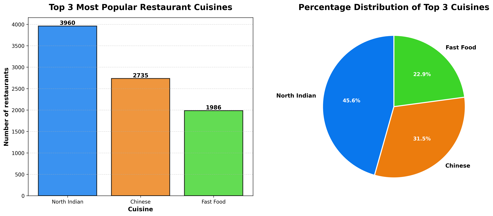

# Restaurant Cuisine Analysis

## 📌 Task 1 – Data Analyst Internship

This repository contains my solution for **Task 1** of my Data Analyst Internship.

### 🛠️ Tools Used
- Python
- Pandas
- Matplotlib

### 📊 Task Performed
- Loaded and validated the dataset
- Cleaned missing values
- Parsed cuisine data
- Identified the top 3 cuisines
- Calculated percentage distribution
- Created bar and pie chart visualizations
- Exported the analysis results

### 📷 Output

